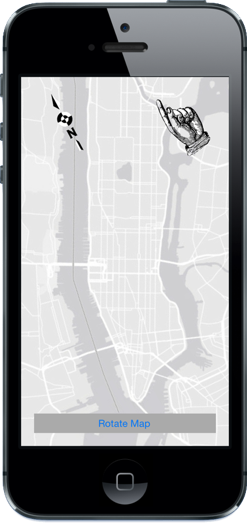

map-northarrow-ios
==================

A category on `UIImageView` to turn it into a North Arrow for the [ArcGIS Runtime SDK for iOS](https://developers.arcgis.com/ios/).



## Features
* Extend `UIImageView` to act as a North Arrow for an `AGSMapView`, rotating its content to match the rotation of that `AGSMapView`.

## Getting Started

### Add the category to your project
1. Drag the `UIImageView+AGSNorthArrow.h` and `UIImageView+AGSNorthArrow.m` files into your ArcGIS Runtime for iOS project in Xcode.
2. `#import` the `UIImageView+AGSNorthArrow.h` file.

### Configure the `UIImageView`
1. Add a `UIImageView` to your user interface. Make sure it does not become a child of your `AGSMapView` (although it can overlap it).
2. Ensure this `UIImageView` is referenced from your code.
3. Set the `mapViewForNorthArrow` property on the `UIImageView` to the `AGSMapView` it represents.
4. Set the Image on the `UIImageView` (sample provided in this repo).
5. The following properties should be set (although they will automatically be set at runtime):
  * Set View Mode to `Aspect Fit`
  * Uncheck `User Interaction Enabled`

Here's a sample ViewController.m:

```Objective-C
#import <ArcGIS/ArcGIS.h>
#import "UIImageView+AGSNorthArrow.h"

@interface AGSNorthArrowSampleViewController ()
@property (weak, nonatomic) IBOutlet AGSMapView *mapView;
@property (weak, nonatomic) IBOutlet UIImageView *northArrow;
@end

@implementation AGSNorthArrowSampleViewController
- (void)viewDidLoad
{
    [super viewDidLoad];

    NSURL *basemapURL = [NSURL URLWithString:@"http://services.arcgisonline.com/ArcGIS/rest/services/Canvas/World_Light_Gray_Base/MapServer"];
    AGSTiledMapServiceLayer *basemapLayer = [AGSTiledMapServiceLayer tiledMapServiceLayerWithURL:basemapURL];
    [self.mapView addMapLayer:basemapLayer];

    self.mapView.allowRotationByPinching = YES;
    self.northArrow.mapViewForNorthArrow = self.mapView;
}
@end
```

## Requirements

* Xcode and the iOS SDK (download [here](https://developer.apple.com/xcode/))
* ArcGIS Runtime SDK for iOS 10.2 or later (download [here](https://developers.arcgis.com/ios/?filename=AGSRuntimeSDKiOSv10.2-u1.pkg&folder=software/ArcGIS_RuntimeSDK/10.2))

## Resources

* [ArcGIS Runtime SDK for iOS](https://developers.arcgis.com/ios/)
* [ArcGIS Runtime SDK Forums](http://forums.arcgis.com/forums/78-ArcGIS-Runtime-SDK-for-iOS)
* [ArcGIS Blog](http://blogs.esri.com/esri/arcgis/)
* Twitter [@esri](http://twitter.com/esri)
* [Apple iOS Dev Center](https://developer.apple.com/devcenter/ios/index.action)
* [North Arrow Clipart](http://www.clker.com/clipart-north-arrow.html)
* [Pointing Finger Clipart](http://www.downloadclipart.net/browse/8100/finger-clipart)

## Issues

Find a bug or want to request a new feature?  Please let us know by submitting an Issue.

## Contributing

Anyone and everyone is welcome to contribute. 

## Licensing
Copyright 2014 Esri

Licensed under the Apache License, Version 2.0 (the "License");
you may not use this file except in compliance with the License.
You may obtain a copy of the License at

   http://www.apache.org/licenses/LICENSE-2.0

Unless required by applicable law or agreed to in writing, software
distributed under the License is distributed on an "AS IS" BASIS,
WITHOUT WARRANTIES OR CONDITIONS OF ANY KIND, either express or implied.
See the License for the specific language governing permissions and
limitations under the License.

A copy of the license is available in the repository's [license.txt](https://raw.github.com/Esri/quickstart-map-ios/master/license.txt) file.
[](Esri Tags: NorthArrow ArcGIS Mobile Mapping iOS iPhone iPad)
[](Esri Language: Objective-C)
